Automating Docker Builds from GitHub
====================================

If the code or applications in your repository can be packed into a Docker image for easier distribution, it is also possible to automatically create these Docker images and push them to Docker Hub. This guide assumes that you already have a working Docker file, and does not explain the usage of Docker, only how to automate this in the context of github.

.. _get_dockerhub_credentials:
Step 1: Get Docker Hub credentials
----------------------------------

First, we need a Docker Hub account that will house your images. You can access your account on `hub.docker.com <https://hub.docker.com/>`_.
If you want the image to be hosted on `https://hub.docker.com/u/computationaloncologyumcg <https://hub.docker.com/u/computationaloncologyumcg/>`_, one of the admins needs to do this first two steps.

There are two things you need from docker hub, to be able to automate the build and upload
- a username to use for uploads
- a Personal Access Token (PAT) to use for uploads

When you go to docker hub, you can click your profile on the top right, to see what your account name is:

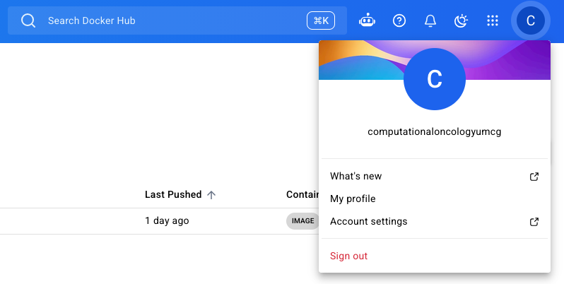

Note that down, as we'll need it later.

Next, we need to make a PAT that we can use. Click on 'Account settings' from your profile, which will open a new tab.

In this new tab, click on 'Personal access tokens' on the left

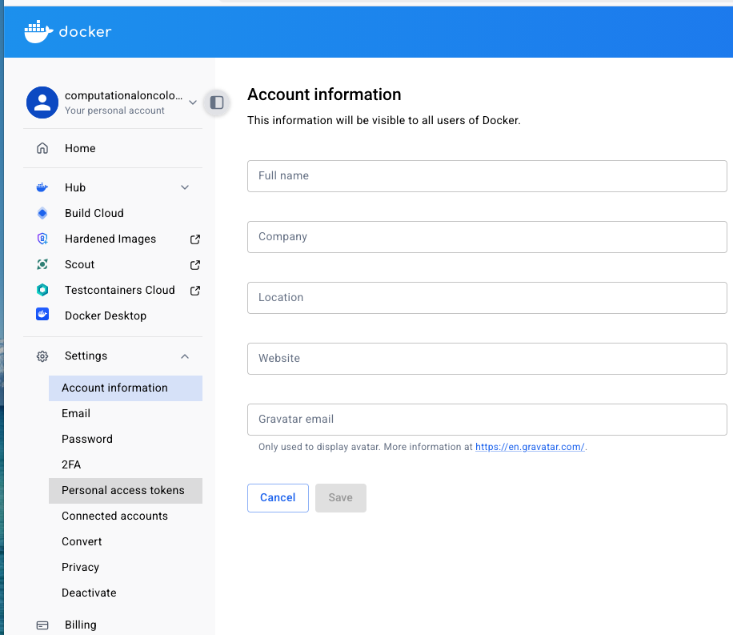

Then, in on the right, click 'Generate new token'

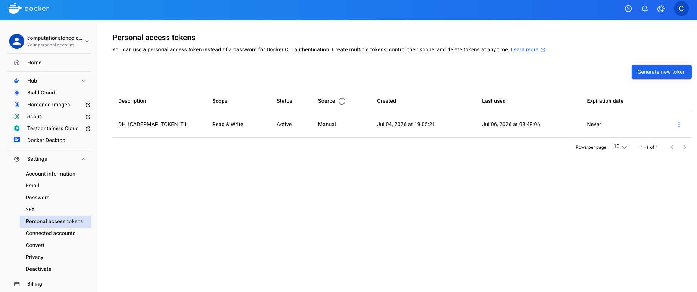

Now we need to create a token that we will use to push to docker hub. The name is personal, but it is best to make this descriptive. The general format I would recommend is: DH\_\[applicationname]_TOKEN_T[nthtoken]. So for example, for ICA-depmap's first token it was 'DH_ICADEPMAP_TOKEN_T1'.

The experation date is configurable, smaller windows are more safe, but require you to update the token more often.

The permissions need to be read/write

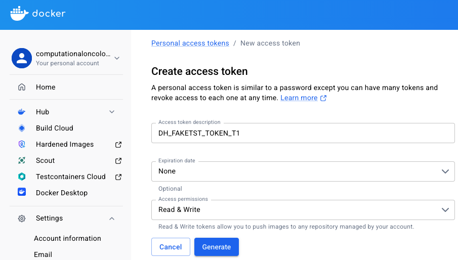

Click 'Generate token'

You will now see the token. Do not close this window, as Docker Hub will not show the token again. (don't worry, I already deleted this token)

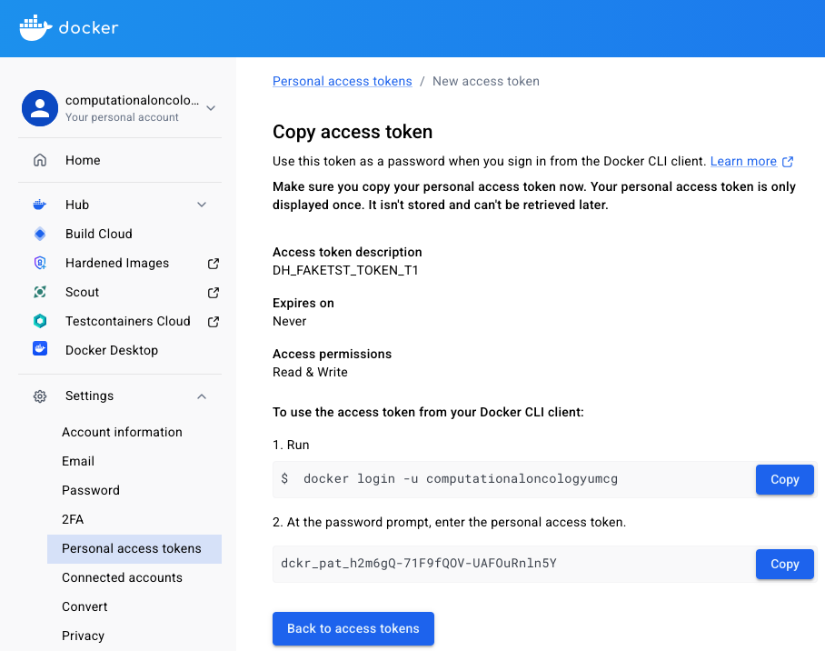

.. _add_dockerhub_credentials:
Step 2: Add Docker Hub credentials to GitHub
--------------------------------------------

Next, we need to add these Docker Hub credentials to GitHub. 

First go to the repository that you want to add the automated building to, and go to 'Settings'.

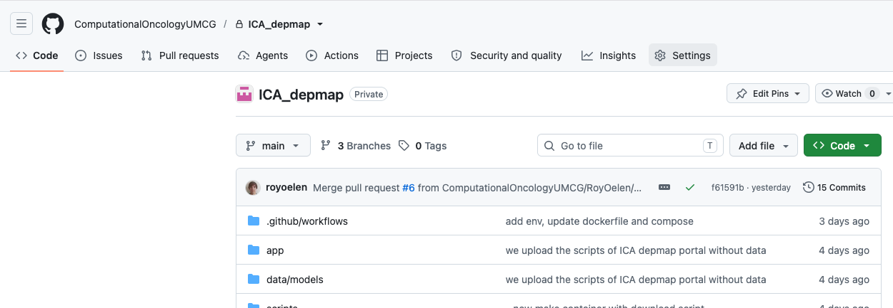

Then we'll goto 'Secrets and variables', then 'Actions'

.. image:: images/github_dockerhub_automation/to_secrets.png
   :alt: to_secrets
   :width: 80%

We will add the username and token as secrets. This way they can be used for authentication, without other people being able to see their actual contents. 
Click 'New repository secret'

.. image:: images/github_dockerhub_automation/click_new_secret.png
   :alt: click_new_secret
   :width: 80%

First we will create a token for the username. The actual secret will simply be the docker hub username. The name is flexible, but I again advise a descriptive name such as DH\_\[applicationname]_USERNAME. For ICA depmap it was for example DH_ICADEPMAP_USERNAME.

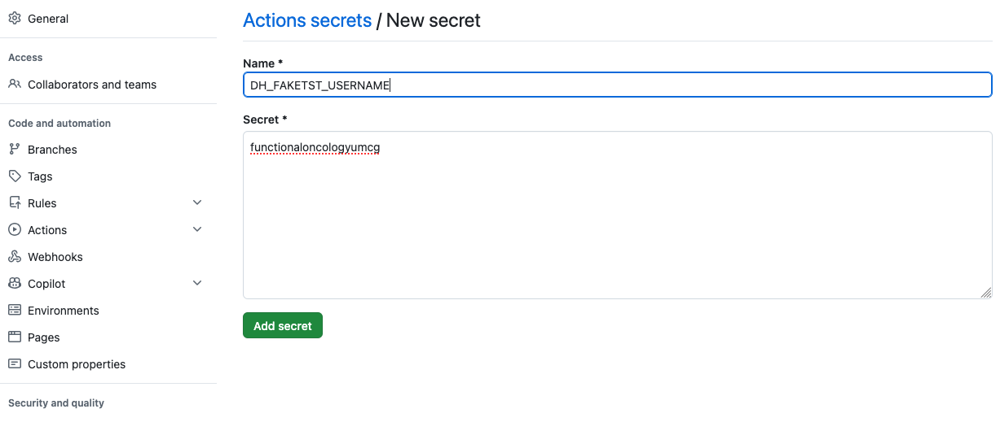

Then click 'Add secret'

You then are returned to the secrets overview, and see the new secret you added to the Repository secrets.

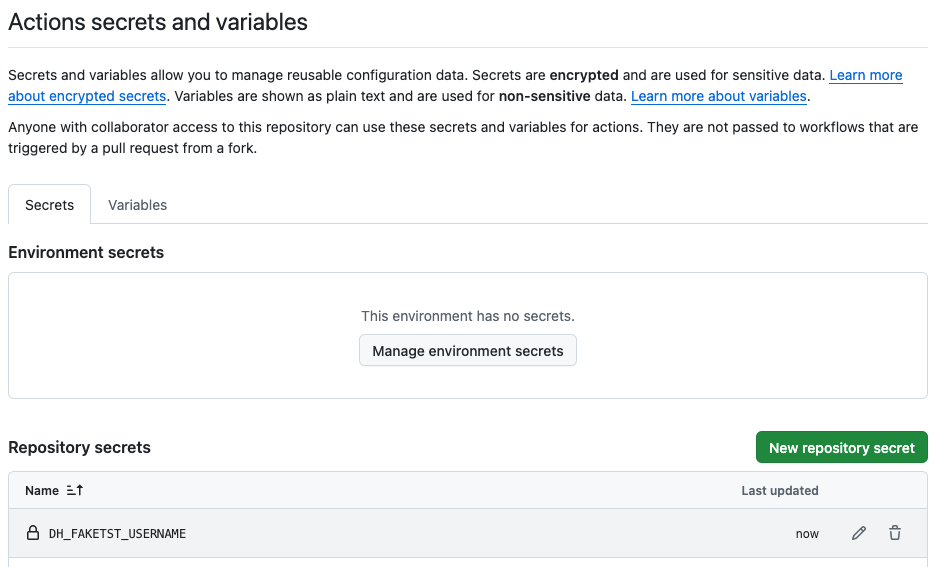

Next, we'll repeat this for the token. In this case I recommend you use the same secret name for the token, as you also used when creating the token on dockerhub.

The actual secret will be the token value you generated on Docker Hub.

If you left that window open, you should be able to copy and paste both of these

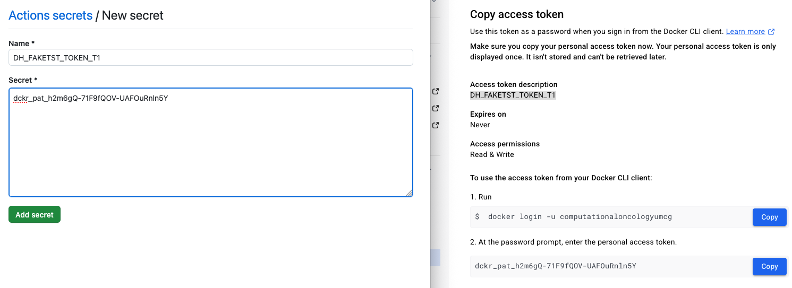

Now both of the secrets should be present in the overview. Make not of how you named both of these.

.. image:: images/github_dockerhub_automation/note_both_tokens.png
   :alt: copy_token
   :width: 80%

.. _add_github_action:
Step 3: Create docker hub action
--------------------------------

Finally, we need to create an action for GitHub so that it knows that we want to perform a build and push. To do this, we need to create a YAML file in a specific directory of our repository.

Specifically we need a YAML in the .github/workflows/ folder. The YAML file created should then also have a descriptive name. For ICA depmap the file for example is .github/workflows/docker-hub-push.yml

.. code-block:: yaml

    name: Build and Push to Docker Hub

    on:
        push:
            branches:
            - main
        workflow_dispatch:

    jobs:
        build:
            runs-on: ubuntu-latest

            steps:
            - name: Checkout code
                uses: actions/checkout@v4

            - name: Set up Docker Buildx
                uses: docker/setup-buildx-action@v3

            - name: Login to Docker Hub
                uses: docker/login-action@v3
                with:
                username: ${{ secrets.DH_ICADEPMAP_USERNAME }}
                password: ${{ secrets.DH_ICADEPMAP_TOKEN_T1 }}

            - name: Build and push
                uses: docker/build-push-action@v5
                with:
                context: .
                file: ./Dockerfile
                push: true
                tags: ${{ secrets.DH_ICADEPMAP_USERNAME }}/ica-depmap:latest

There are a couple of import things.

The 'on' tells github when to do this task. In this ICA depmap example, a new image is pushed when the main branch is pushed to, i.e. when a significant change is made. If you want this to happen more often because you need to test images faster, you can add also add other branches that trigger a build.

A number of steps are part of GitHub and you don't need to manually configure. GitHub however needs your Dockerhub username and token to authenticate. These we have already added to our secrets, and can be extracted using the names of the secrets that we gave.

For the actual push, there needs to be a Dockerfile present, this is supplied in the last step.

Finally, we will push to a tag on DockerHub, since we are using individual repositories for now, the first part of the tag will be the same as the username. The second part will be the name of the generated container, and should describe your application. For ICA depmap, it is for example ica-depmap.

Now, when the 'on' is triggered, an action will take place, which we can view via the 'Actions' tab of the repository

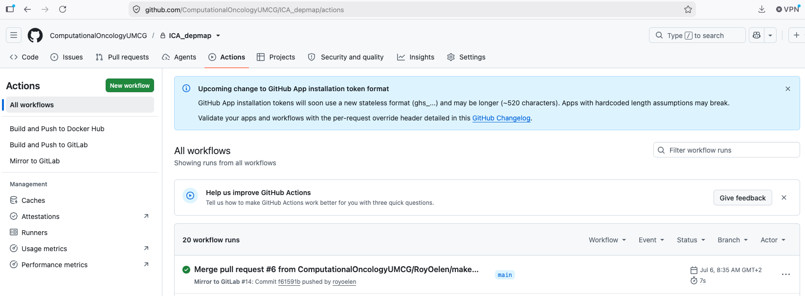

Additionally, the resulting image should now be present on Docker Hub

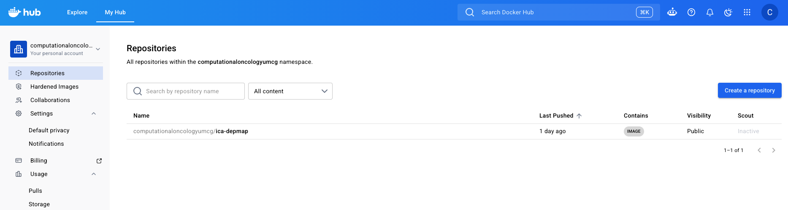
