Github via the GitHub Desktop app
=================================
This page describes how to use Github Desktop for GitHub in the Computational Oncology group

.. _installing_ghdesktop:
Installing Github Desktop
--------------------------------

If you have chosen to use Github Desktop, you need to first install it. You can download it at the `URL <https://desktop.github.com/download/>`_, however I recommend you install it using `brew <https://formulae.brew.sh/cask/github/>`_ or `chocolatey <https://community.chocolatey.org/packages/github-desktop>`_

.. _linking_to_github:
Linking to GitHub account
--------------------------------

To use github for pushing to a repository, as well as pulling and cloning from a private repository, you need to log into your GitHub account.
Fortunately, this is fairly easy using GitHub Desktop. Upon first boot it will immedialy ask you to log in. Select the left option 'sign into github.com':

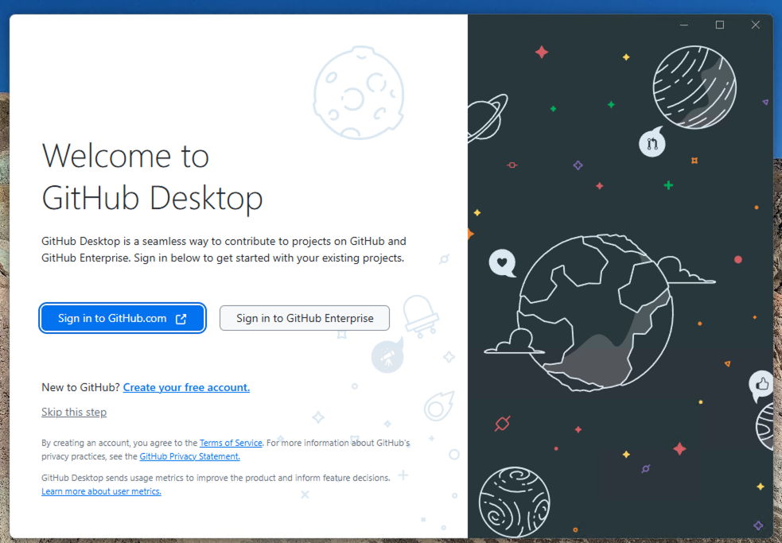

This will open a browser window where you can either immediatly link, or can log in and then link. Select 'continue'.

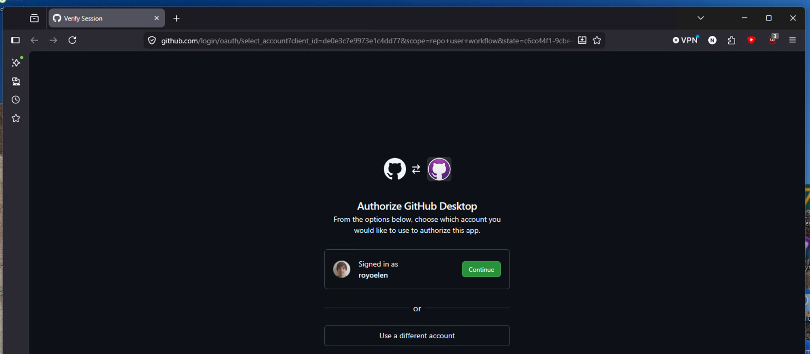

Next, allow the browser to open GitHub Desktop by clicking 'open link'

Then choose which email to use and continue

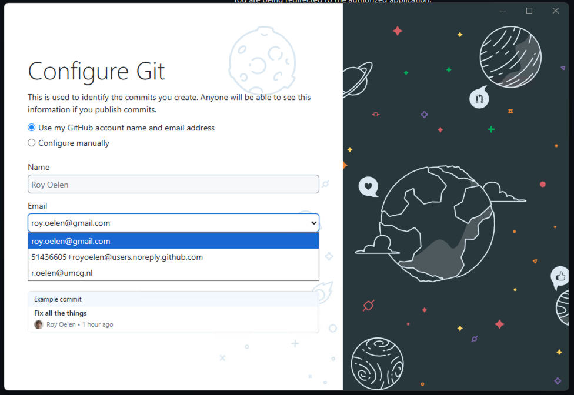

Now you will see an overview where you can scroll through all the github respositories you have access to

.. _set_up_github_web:
Setting up branches on the GitHub webpage
-----------------------------------------

First we need to go to the web page of github at `gitlab.com <https://github.com/ComputationalOncologyUMCG/>`_

If you do not immediatly land on the ComputationalOncologyUMCG page, go there through your organisations:

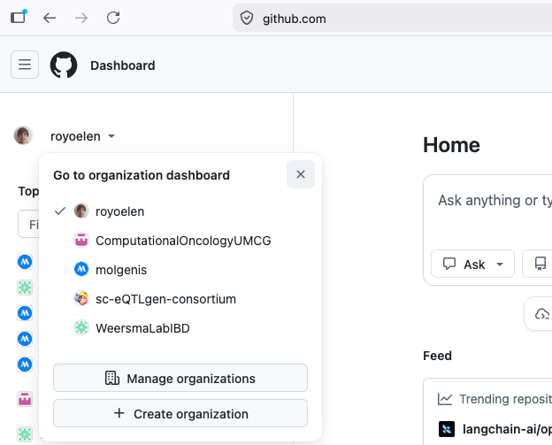

View the organzation:

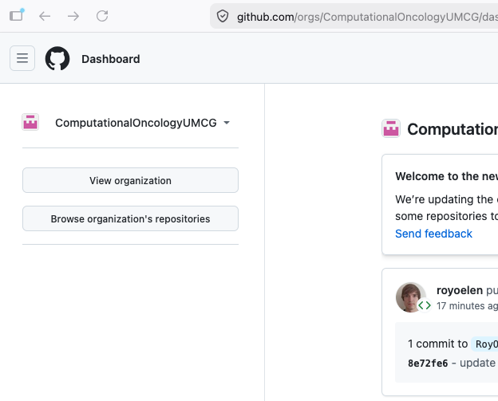

If you do not see the organisations, make sure that you are a part of the organisation (:doc:`prerequisites`)

Go to the team that manages your project

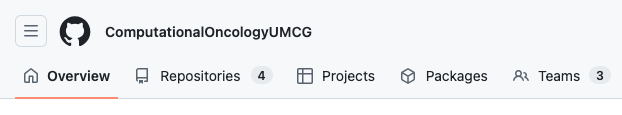

Your team might be part of a subteam, if so, click on the parent team first.
If you don't see the team, make sure you are part of the team (:doc:`prerequisites`)

Now, click on repositories

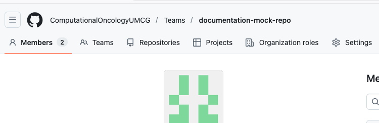

And select the repository (there should be only one). If the repository is not present, linking of the team and the repository might not be complete, please contact one of the admins.

You will initially see the current status of the 'main' or 'master' branch. This is considered the 'it-just-works' branch, and usually will only be written to when a certain task has been finished, and is deemed good enough. Writing directly to this branch is not recommended, and generally frowned upon.

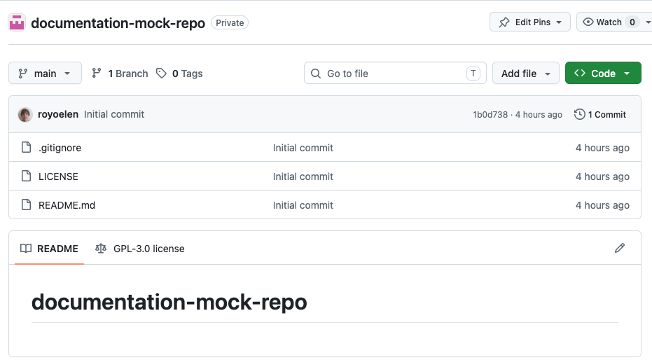

By clicking the dropdown in the top left, you can see the current branches.

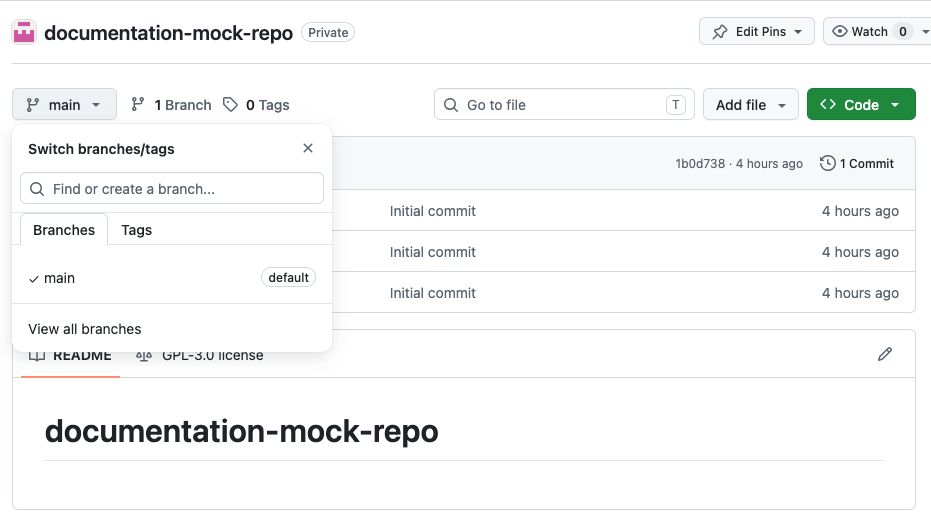

When you want to contribute the codebase, the correct way to do this is by making a new branch, adding what you need to that branch, and then merging that branch back into main/master
For example, this is a repository where there is the main to the left, and branching and merging tracks on the right:

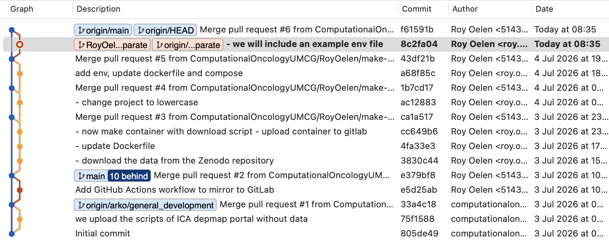

We can immediatly make our own branch in the same dropdown menu, by starting to type and then clicking 'Create branch [branchname]'. Branch names should be descriptive. Best is to start with your username, so your branch can be identified, followed by a slash and what you plan to do with the branch. If you are adding specific functionality, put that in the name. If you are doing some 'general' development, as is normal when you are starting out, you can name it something like 'username/general_development'

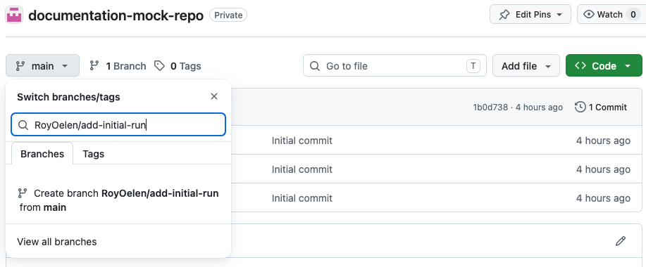

After creating the branch, you will land on the page showing the state of that branch (which for now is the same as main/master)

.. _work_on_branch_gh_desktop:
Working on branch in GitHub Desktop
-----------------------------------

Go back to GitHub Desktop, and select File, Clone repository

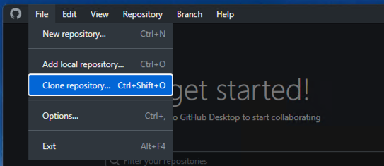

The search for your repository name. If it doesn't pop up, click the refresh button next to the text field to make it update the available repositories.

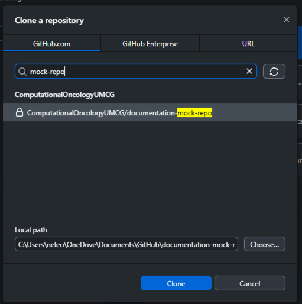

You can modify the path where it will be stored on your machine if you wish. Next click on 'clone'.

This will clone the relevant data and open the overview. From here, we can switch to our own branch by clicking the 'branch' box in the centre and then selecting our branch from the dropdown. If you don't see your branch (yet). You can click 'Fetch origin' to get an update on changes that may have occured to the project.

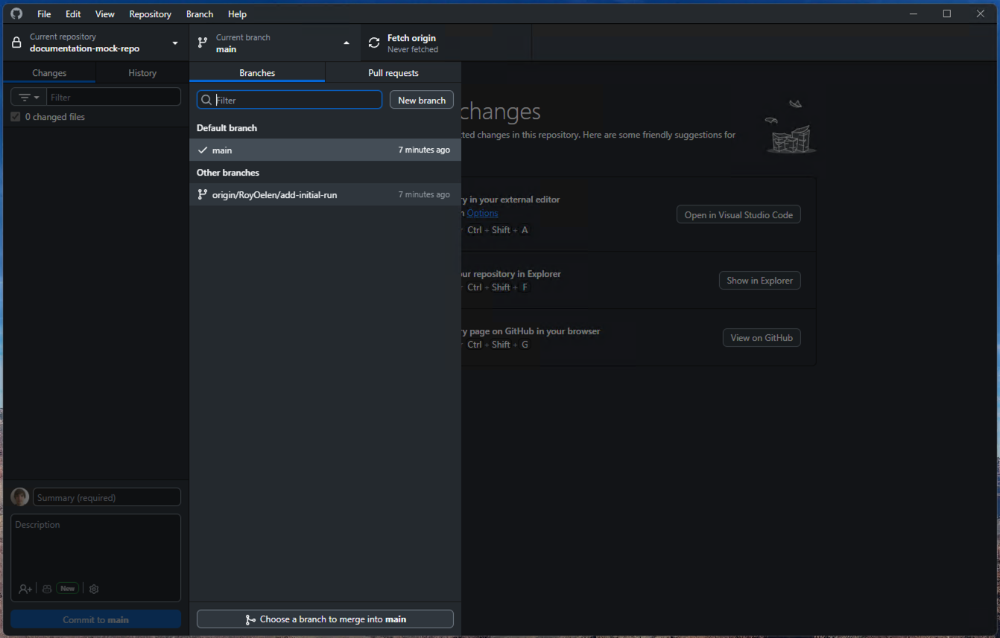

Now you will locally have the branch. You can start editing and adding files to it.

Whenever you want to store your changes, you can open up GitHub Desktop again. Select the right repository on the top left. 
On the top left you will see the files that were changed. On the right you can see what changed specifically in each file.
On the bottom left, enter a short and longer message describing the changes that you made. Then click 'commit...'

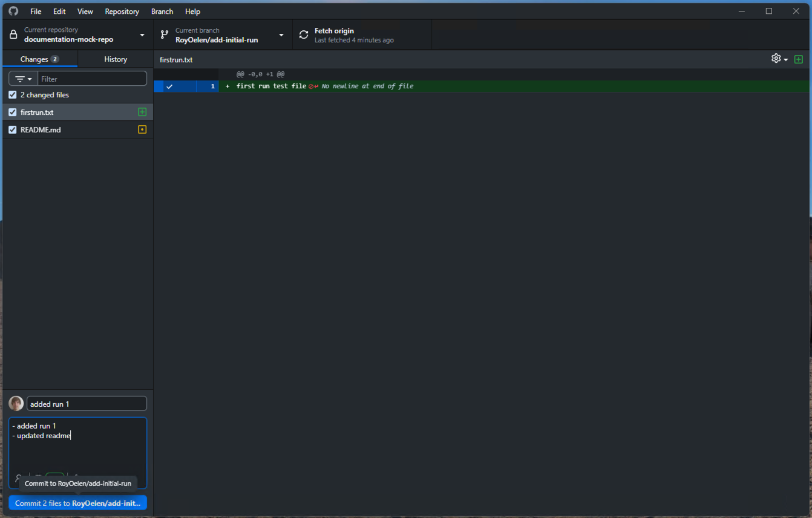

This has only committed the changes locally. Next we need to push these changes to GitHub. You can do this by either clicking the blue 'Push origin' button, or clicking the 'Push origin' box at the top.

.. image:: images/github_via_github_desktop/push.png
   :alt: push
   :width: 80%

If you would go back to the github page for this repository, then would specifically check your branch, you would see the changes you just made.

Should you update your branch from a different machine, or via github web itself (not recommended), you can also view them locally by doing a 'fetch origin'

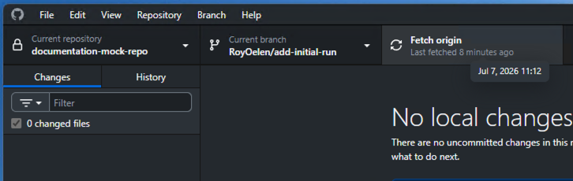

You can then add those changes to your machine by doing a subsequent pull by clicking the 'Pull origin' button, or by going to the top and click 'Repository', then 'Pull'

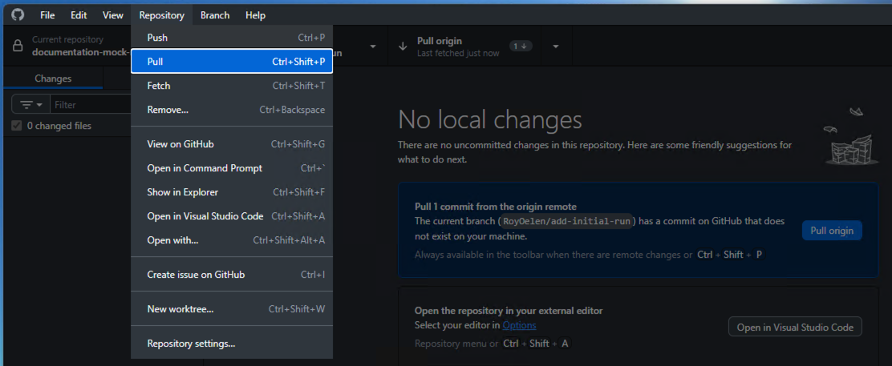

.. _merging_branch:
Merging your branch with Main/Master
------------------------------------

When you feel like your branch has finished the feature you set out, or you feel that enough has been added, you can merge your work onto the Main/Master branch.

Go to the github page, and click 'branches'

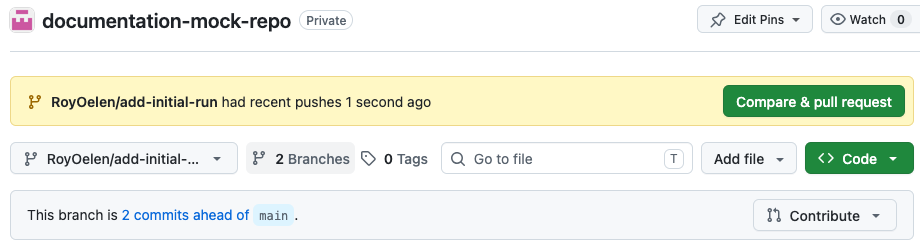

Select your branch, click the dot menu, and select 'New pull request'

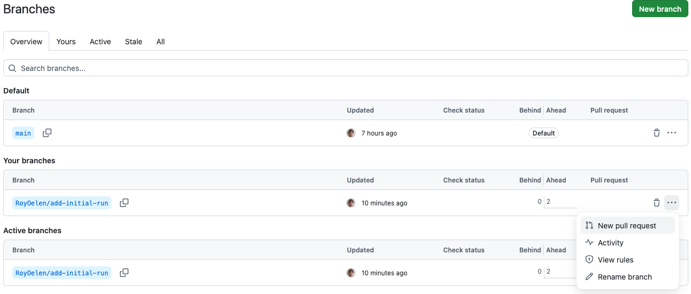

Title your pull request, and describe what it is adding. If you want, you can add a reviewer to review your changes. Then click 'Create pull request'

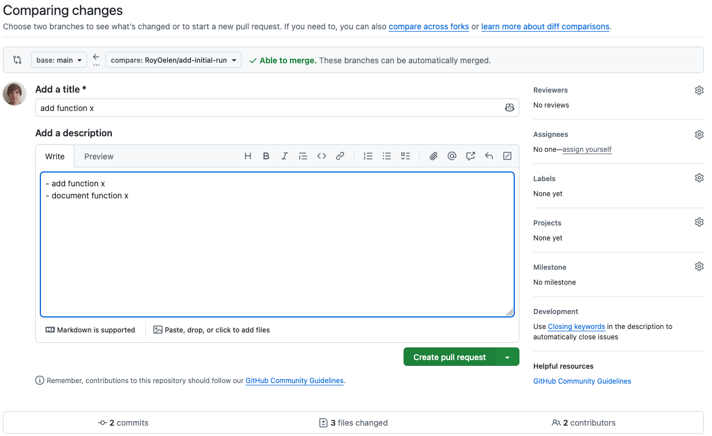

This will open the pull requests page. You can immediatly merge the pull request, or wait for someone to review it for you first.

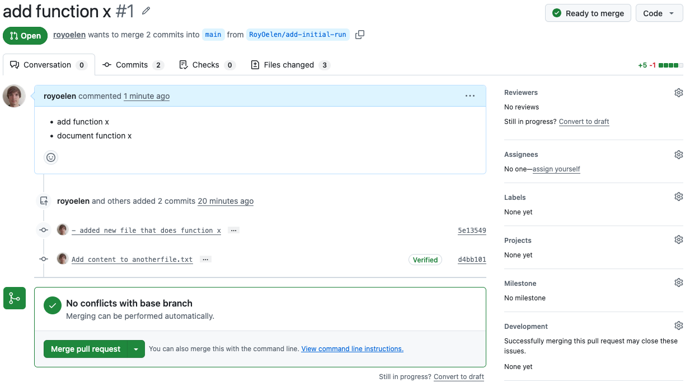

You can now merge it yourself, or wait for reviews first. 

If you want to return to the pull requests later, you can see all of them via the 'pull requests' tab

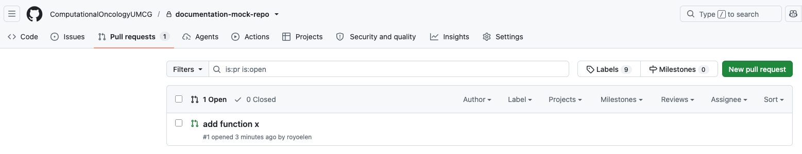

.. _cleaning_up:
Cleaning up after a merge
-------------------------

If you feel like the branch has served its purpose after a merge, you can remove. First however, pull changes in sourcetree, then switch back to the remote main branch by selecting it on the left

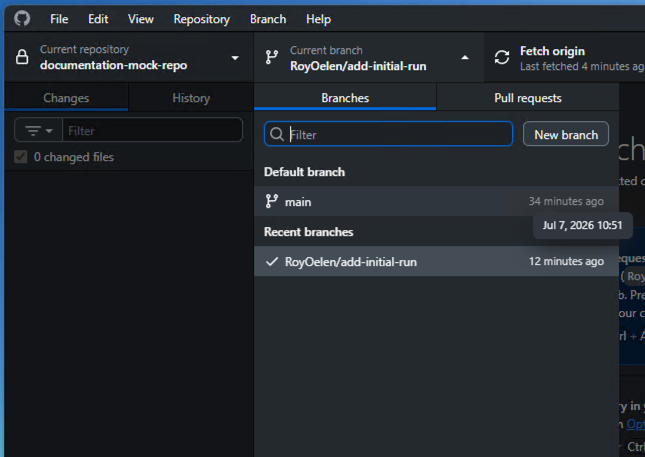

Then go back to the github webpage, make extra sure your changes have actually been merged into the main/master and remove the branch you created

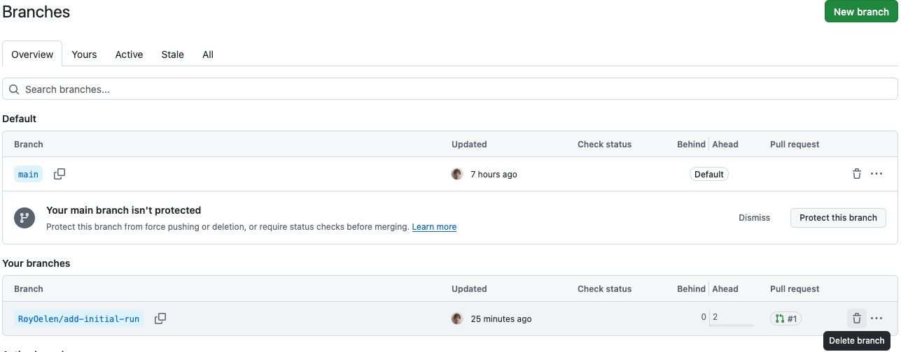
