Using Sourcetree with GitHub
============================

This page describes how to use Sourcetree for GitHub in the Computational Oncology group

.. _installing_sourcetree:
Installing Sourcetree
--------------------------------

If you have chosen to use Sourcetree, you need to first install it. You can download it at the `URL <https://www.atlassian.com/software/sourcetree/>`_, however I recommend you install it using `brew <https://formulae.brew.sh/cask/sourcetree/>`_ or `chocolatey <https://community.chocolatey.org/packages/SourceTree>`_

.. _adding_github_pats:
Adding Github PAT to Sourcetree
--------------------------------

To use github for pushing to a repository, as well as pulling and cloning from a private repository, you will need a Personal Access Token (PAT).
You need to do this for each new machine that you work on, as well as when a PAT expires.

For generating a PAT, first go to your profile by clicking on it in the top-right, then click on Settings

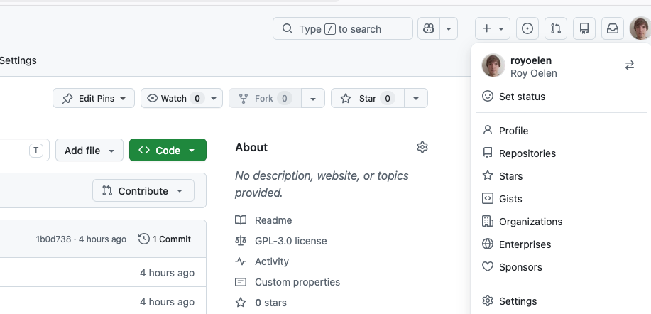

Then, scroll all the way down on the left, to 'developer settings'

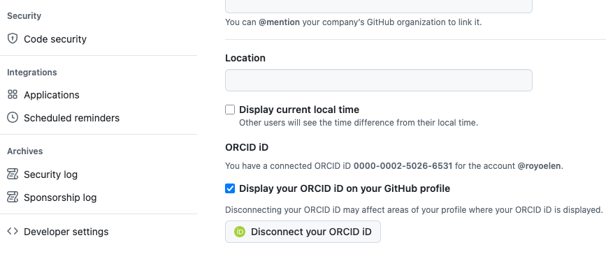

Next, go to 'personal access tokens' and 'Tokens (classic)'

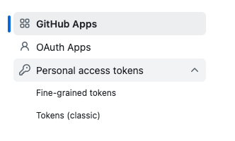

Generate a new classic token

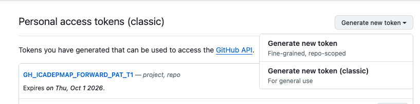

Enter the information for the token. The token will be personal, so naming is up to you. It is recommended however to put in the name for which machine you are doing this, and n-th token this is. This allows you to keep better track of them.
The expiration also depends on you, but three months is recommended, as this is a good balance of security while not having to create a new one too often.
The minimal permissions you need to give, is the 'repo' one. Finally click 'Generate token' at the bottom.

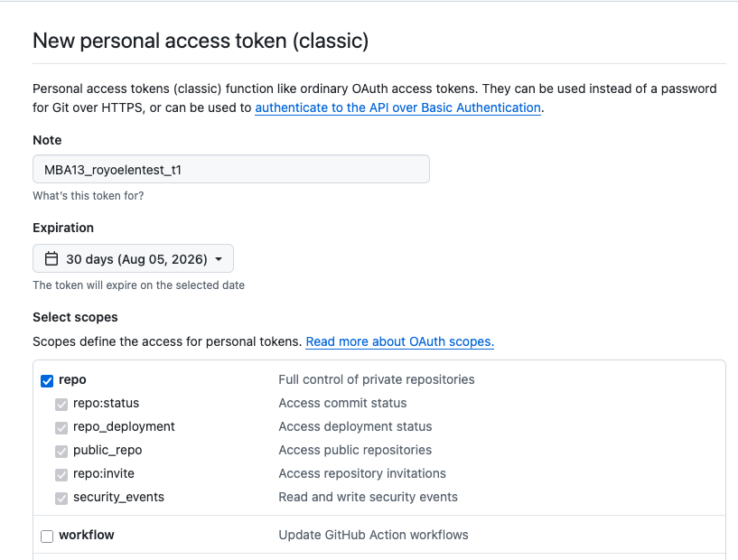

You will then be shown the new token (don't worry, this example has already been deleted). Github however, will only show the token now, so do not close this tab until you have copied over the PAT to SourceTree.

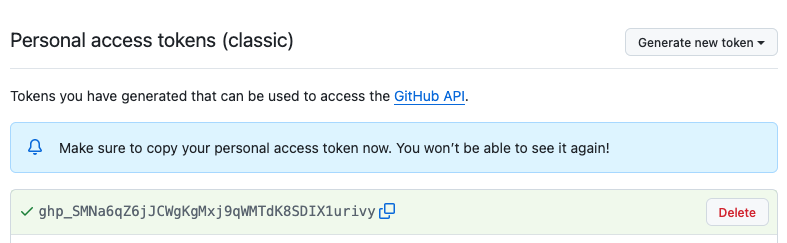

Now, open Sourcetree. If this is the first time opening it, go through the initial setup and skip whatever logins it asks for.
In the main sourcetree window, go to settings

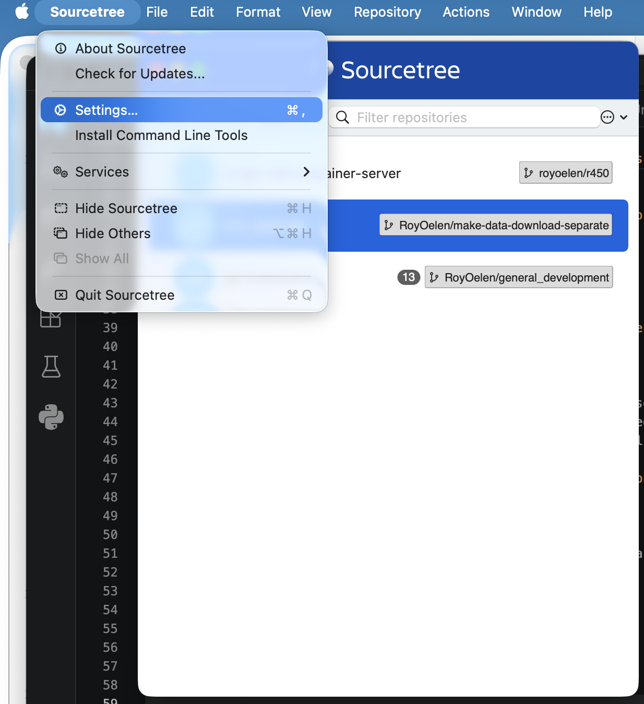

Then go to the 'accounts' tab, and click 'add'

In this screen, set the host github, auth type to Personal Access Token, username your github username and protocol to HTTPS. In the personal access token field, paste the token you generated before.
Then click save.

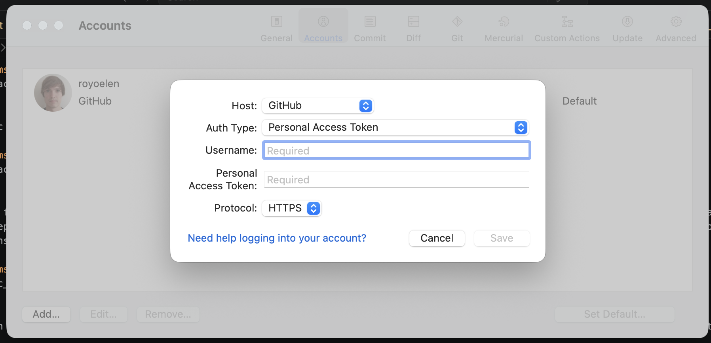

For the future, when you need to update the PAT, you can edit the account via this same window, and paste an updated PAT.

.. _set_up_github_web:
Setting up branches on the GitHub webpage
-----------------------------------------

First we need to go to the web page of github at `gitlab.com <https://github.com/ComputationalOncologyUMCG/>`_

If you do not immediatly land on the ComputationalOncologyUMCG page, go there through your organisations:

.. image:: images/teams_and_repos_for_admins/to_organization_dashboard.png
   :alt: to_organization_dashboard
   :width: 80%

View the organzation:

.. image:: images/teams_and_repos_for_admins/view_organization.png
   :alt: view_organization
   :width: 80%

If you do not see the organisations, make sure that you are a part of the organisation (:doc:`prerequisites`)

Go to the team that manages your project

.. image:: images/teams_and_repos_for_admins/click_teams.png
   :alt: click_teams
   :width: 80%

Your team might be part of a subteam, if so, click on the parent team first.
If you don't see the team, make sure you are part of the team (:doc:`prerequisites`)

Now, click on repositories

.. image:: images/teams_and_repos_for_admins/click_repositories.png
   :alt: click_repositories
   :width: 80%

And select the repository (there should be only one). If the repository is not present, linking of the team and the repository might not be complete, please contact one of the admins.

You will initially see the current status of the 'main' or 'master' branch. This is considered the 'it-just-works' branch, and usually will only be written to when a certain task has been finished, and is deemed good enough. Writing directly to this branch is not recommended, and generally frowned upon.

.. image:: images/github_via_sourcetree/repo_view_main.png
   :alt: repo_view_main
   :width: 80%

By clicking the dropdown in the top left, you can see the current branches.

.. image:: images/github_via_sourcetree/repo_dropdown_branches.png
   :alt: repo_dropdown_branches
   :width: 80%

When you want to contribute the codebase, the correct way to do this is by making a new branch, adding what you need to that branch, and then merging that branch back into main/master
For example, this is a repository where there is the main to the left, and branching and merging tracks on the right:

.. image:: images/github_via_sourcetree/branching_example.png
   :alt: branching_example
   :width: 80%

We can immediatly make our own branch in the same dropdown menu, by starting to type and then clicking 'Create branch [branchname]'. Branch names should be descriptive. Best is to start with your username, so your branch can be identified, followed by a slash and what you plan to do with the branch. If you are adding specific functionality, put that in the name. If you are doing some 'general' development, as is normal when you are starting out, you can name it something like 'username/general_development'

.. image:: images/github_via_sourcetree/repo_create_branch.png
   :alt: repo_create_branch
   :width: 80%

After creating the branch, you will land on the page showing the state of that branch (which for now is the same as main/master)

.. _work_on_branch_sourcetree:
Working on branch in Sourcetree
-----------------------------------------

Now we are going to move onto working in SourceTree. But first we need the URL of the repository. On the repository page, click code, then on the copy icon next to the URL text:

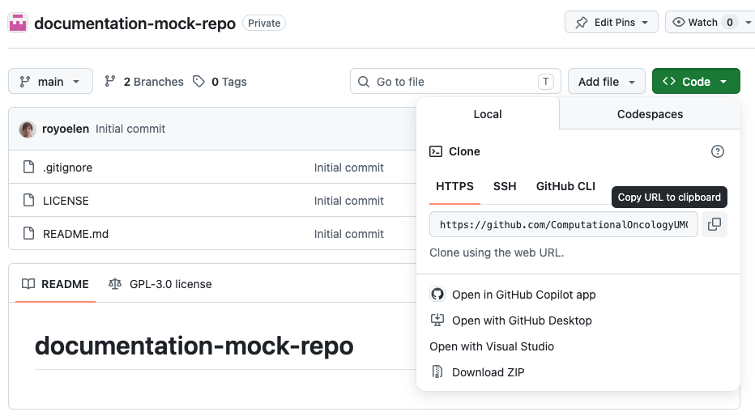

Now open the Sourcetree main window, then New, then clone via URL 

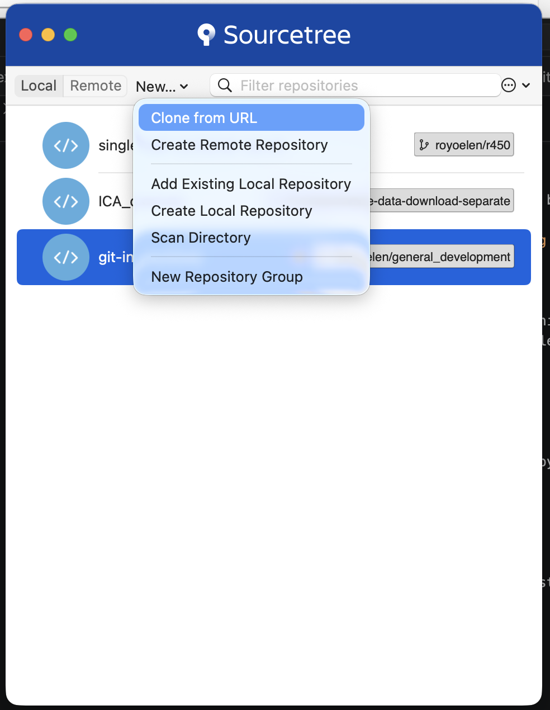

Enter the URL. When you click one of the other fields, defaults will be filled in. You can change the name and path if you wish.

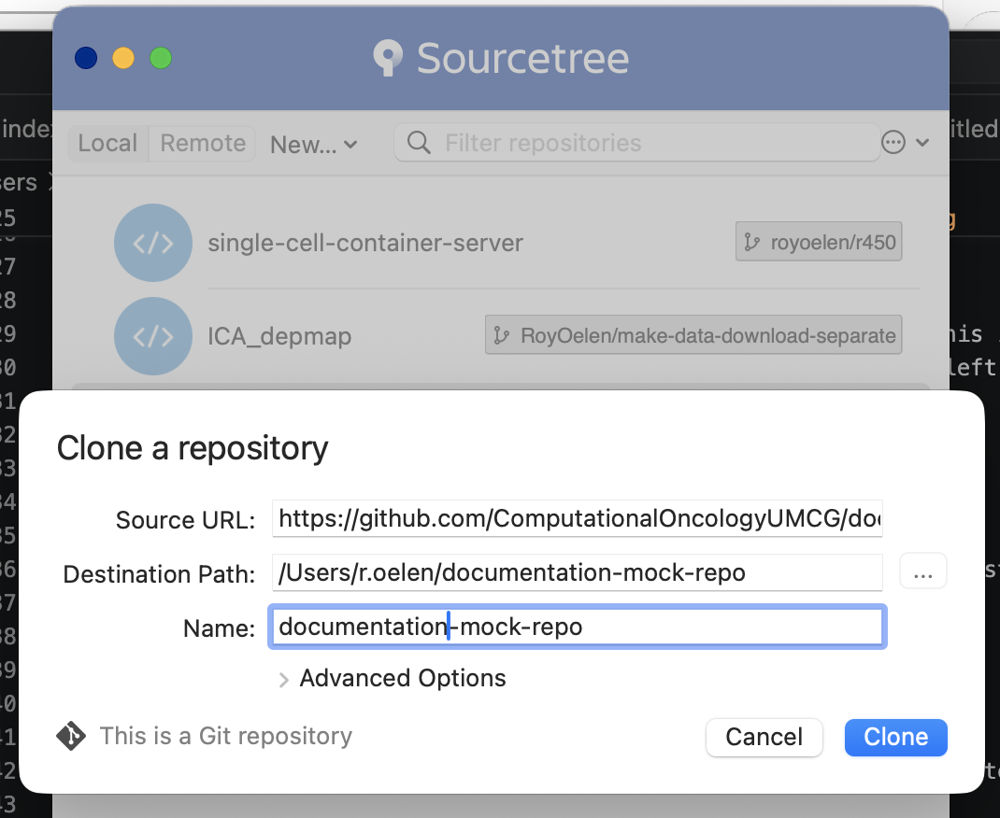

The repository overview should open now, but you can also open it by double-clicking the repository in the sourcetree main window.

Now switch to the branch you created, by double-clicking it in the left window under 'remotes'

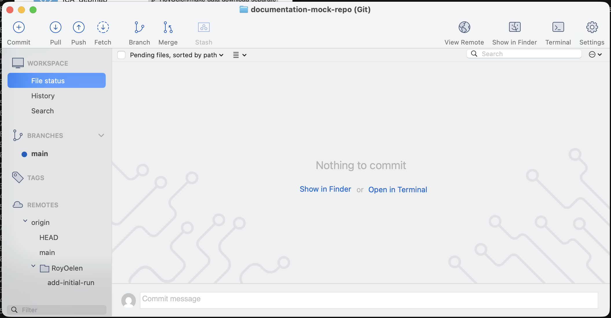

Select checkout

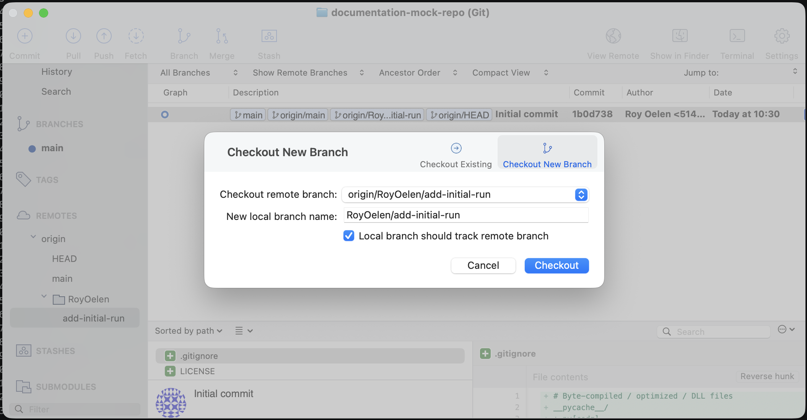

Now your local files should reflect the status of your remote branch. You can start creating and editing the files. 

Whenever you want to store your changes, you can open up soucetree again. Then select 'commit'.

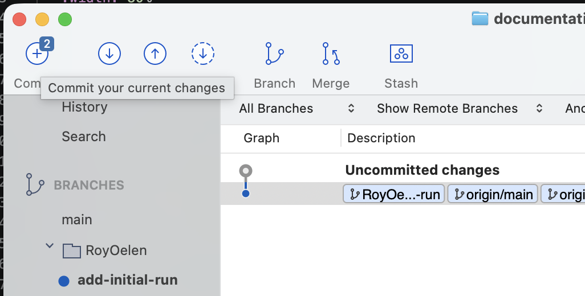

You will be shown a possible list of files that you can commit with changes. In most cases you will want to add all changes, but if there are for example some cache files generated, you might not want to commit those.

In any case, add a descriptive message that encapsulates the work that you did. Also check the box on the button on the bottom, as that will save us from having to click 'push' manually.

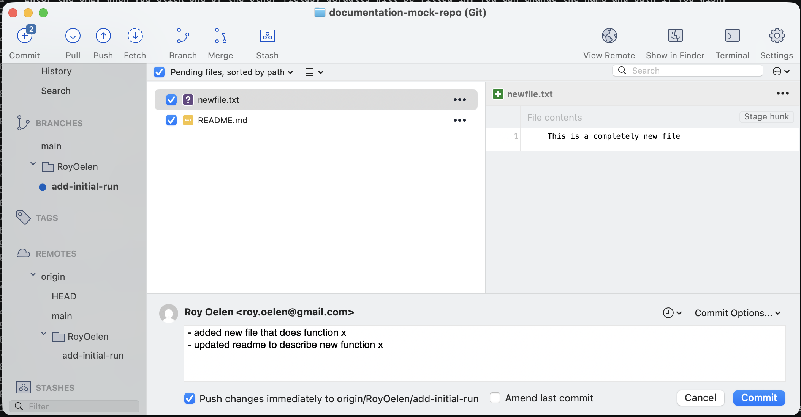

If you would go back to the github page for this repository, then would specifically check your branch, you would see the changes you just made.

Should you update your branch from a different machine, or via github web itself (not recommended), you can also view them locally by doing a 'fetch'

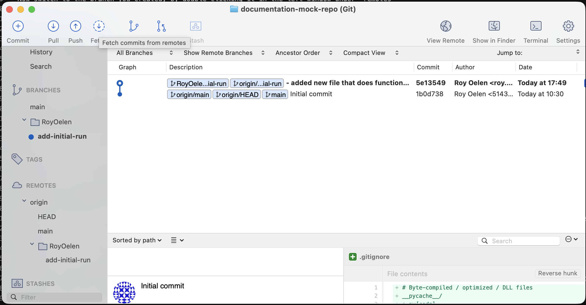

You can then add those changes to your machine by doing a subsequent 'pull'

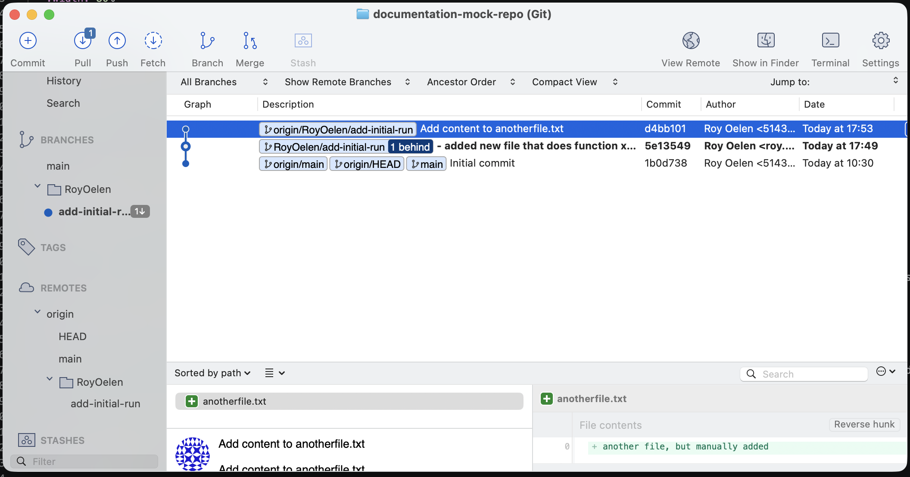

.. _merging_branch:
Merging your branch with Main/Master
------------------------------------

When you feel like your branch has finished the feature you set out, or you feel that enough has been added, you can merge your work onto the Main/Master branch.

Go to the github page, and click 'branches'

.. image:: images/github_via_sourcetree/click_branches.png
   :alt: do_pull
   :width: 80%

Select your branch, click the dot menu, and select 'New pull request'

.. image:: images/github_via_sourcetree/click_new_pull_request.png
   :alt: click_new_pull_request
   :width: 80%

Title your pull request, and describe what it is adding. If you want, you can add a reviewer to review your changes. Then click 'Create pull request'

.. image:: images/github_via_sourcetree/describe_pull_request.png
   :alt: describe_pull_request
   :width: 80%

This will open the pull requests page. You can immediatly merge the pull request, or wait for someone to review it for you first.

.. image:: images/github_via_sourcetree/view_pull_request.png
   :alt: view_pull_request
   :width: 80%

You can now merge it yourself, or wait for reviews first. 

If you want to return to the pull requests later, you can see all of them via the 'pull requests' tab

.. image:: images/github_via_sourcetree/view_all_prs.png
   :alt: view_all_prs
   :width: 80%

.. _cleaning_up:
Cleaning up after a merge
-------------------------

If you feel like the branch has served its purpose after a merge, you can remove. First however, pull changes in sourcetree, then switch back to the remote main branch by selecting it on the left

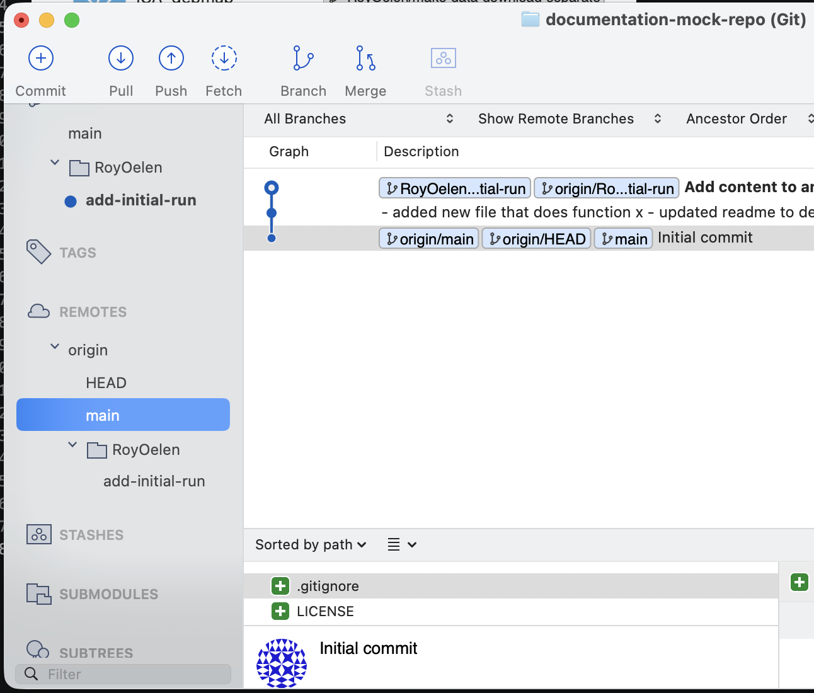

Then go back to the github webpage, and remove the branch

.. image:: images/github_via_sourcetree/remove_branch.png
   :alt: switch_to_main
   :width: 80%

