Linking Github to Gitlab for admins
===================================

If you want to use the issue tracker and planning of GitLab, with a repository on GitHub, you can link your GitHub repository to GitLab.

.. _create_gitlab_repository:
Step 1: Create GitLab repository
--------------------------------

Visit the `GitLab <https://gitlab.com/>`_ webpage 
Go to the 'Groups' and select 'ComputationOncologyUMCG'

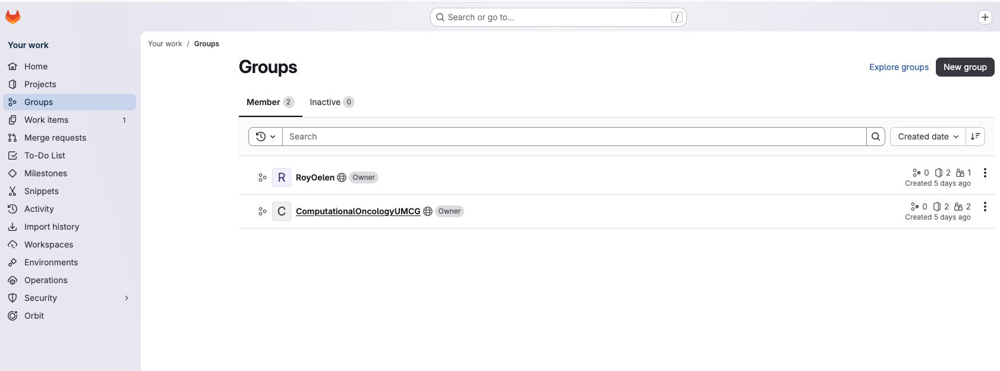

Then create a new project using 'Create project'

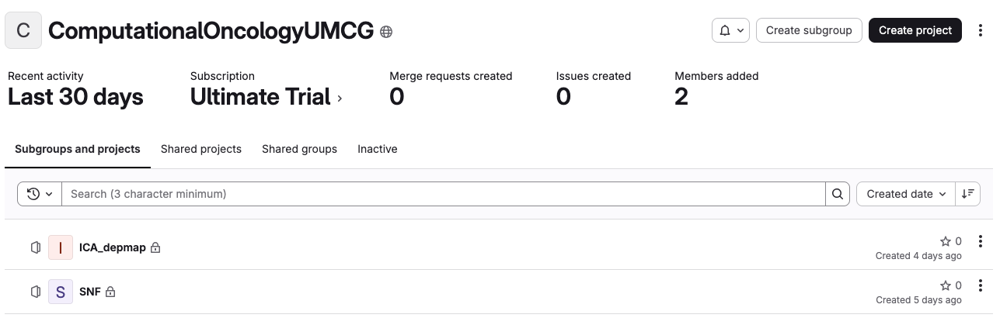

Create a blank project

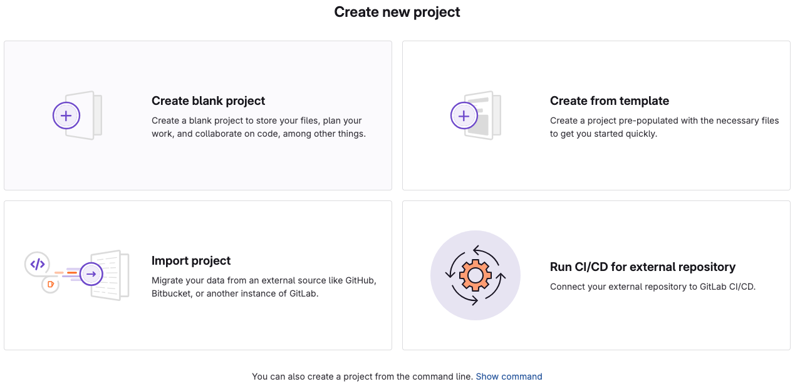

Use the same 'project name' and 'project slug' that you also used on github, to make things clear.
Make sure you uncheck all of the 'Project Configuration' boxes.
Then click 'Create project'

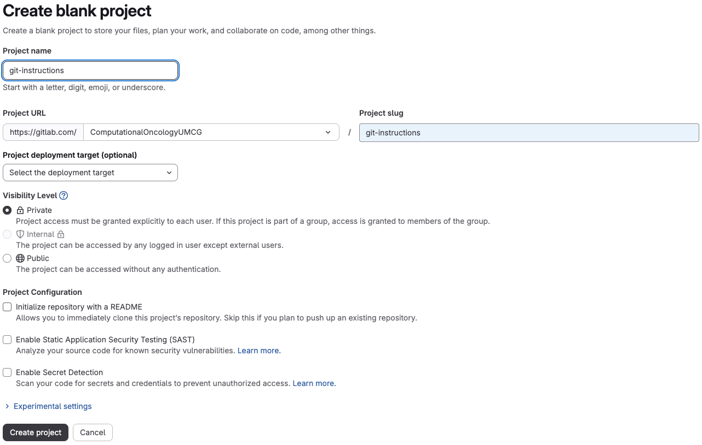

Next go to 'Settings', 'Access tokens'

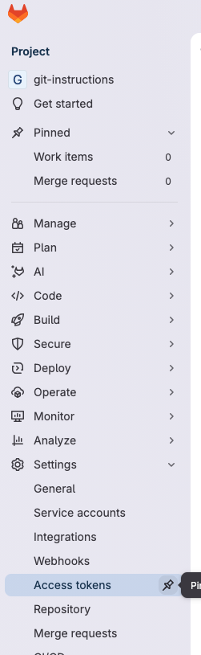

Then 'Add new token'

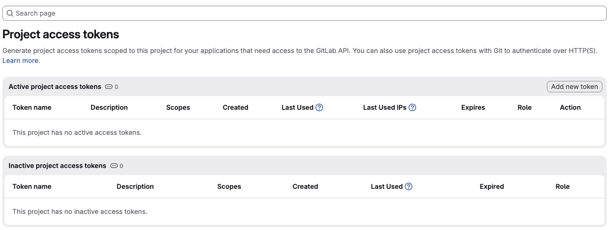

Here we'll create a token. Naming should follow the GL\_\[applicationname]_FORWARD_TOKEN_T[nthtoken]. So for this example, it would be 'GH_GITINSTRUCTIONS_FORWARD_TOKEN_T1'

Set a description that states this token is used for forwarding.

Use the maximum expiration data, as that is a year.

Set the 'Maintainer' role

check the boxes for: 

- read_repository
- write_repository

Then 'Create project access token'

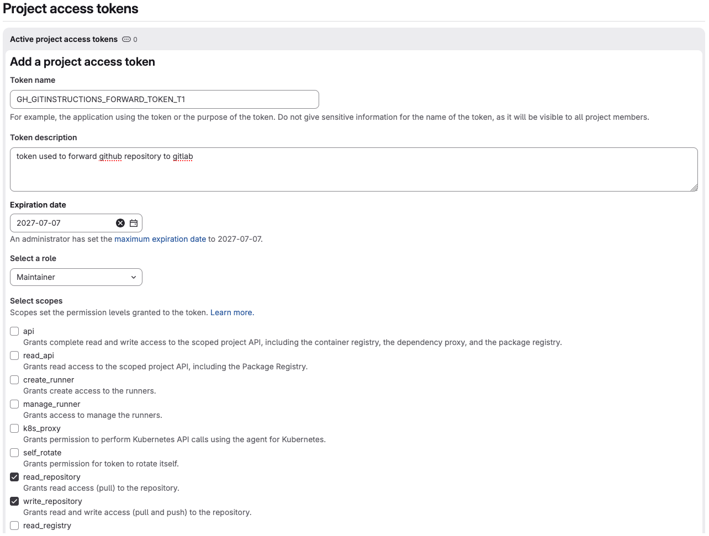

The token will be created. Keep this tab open, as you won't be able to get the token again.

Finally, double-check your username, as we'll also need that for authentication. It will be what is after the '@'

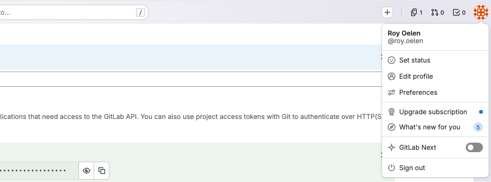

.. _add_gitlab_secrets:
Step 2: Add GitLab secrets
--------------------------

Now go back to GitHub, and go to the github repository you are trying to manage on GitLab. There, go to 'Settings':

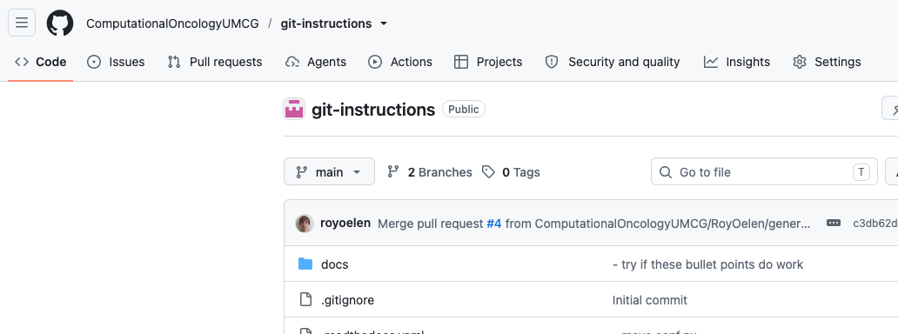

Then we'll goto 'Secrets and variables', then 'Actions'

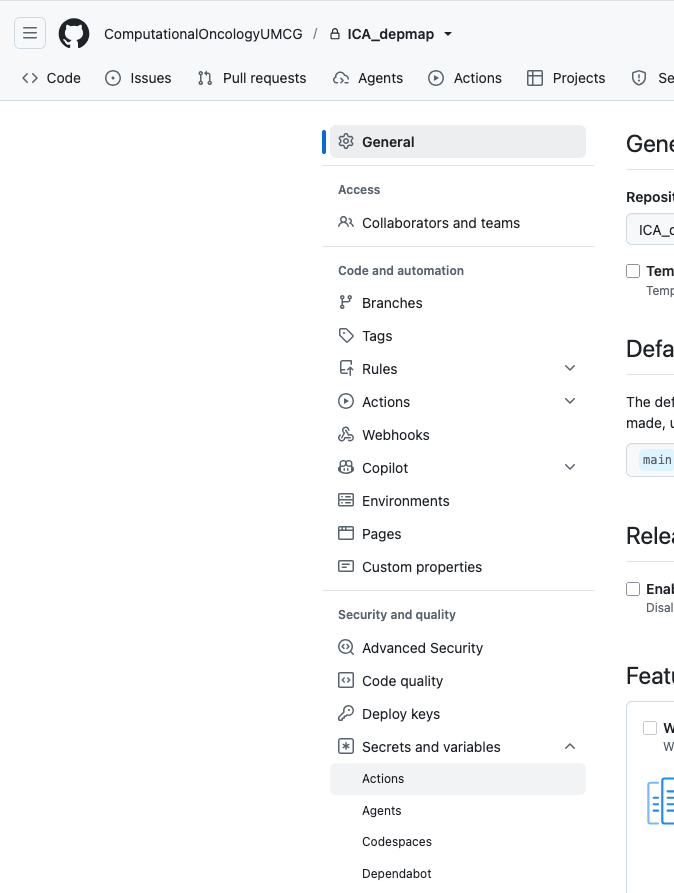

We will add the username and token as secrets. This way they can be used for authentication, without other people being able to see their actual contents. 
Click 'New repository secret'

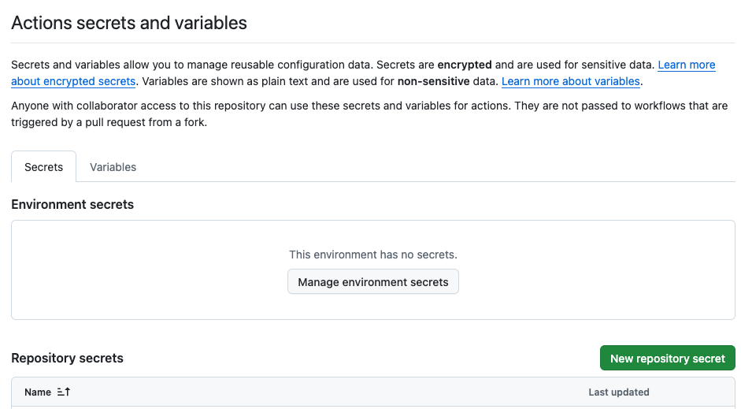

First, we'll add the GitLab user as a secret. We should name this as this GH\_\[applicationname]_FORWARD_USER. So here it would be GH_GITINSTRUCTIONS_FORWARD_USER

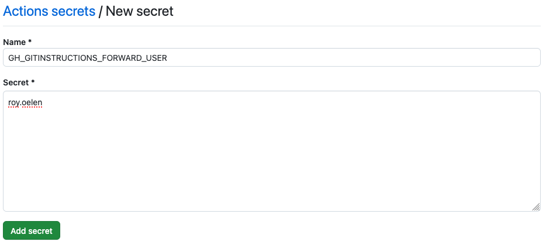

You'll then see the secret being added.

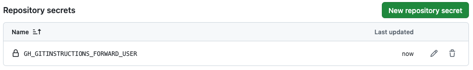

Next, we'll need to add a secret for the token we generated before. Use the same name you used when creating the gitlab token, and copy the token from GitLab.

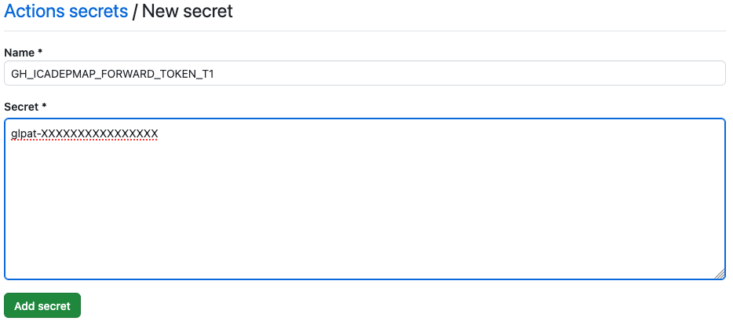

TO BE CONTINUED
