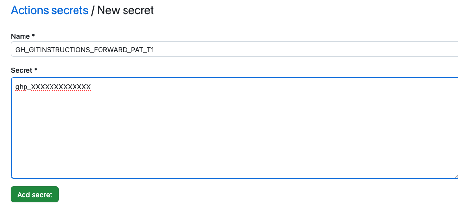
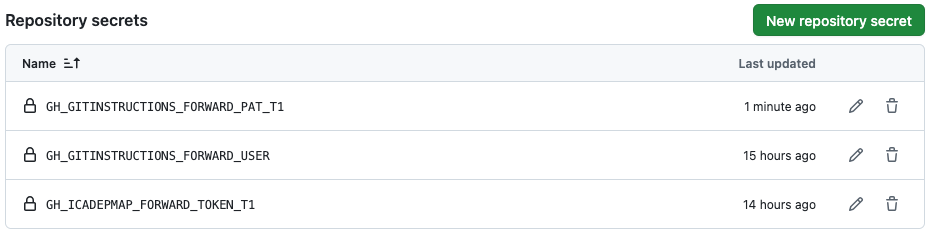
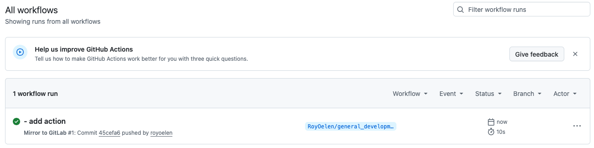
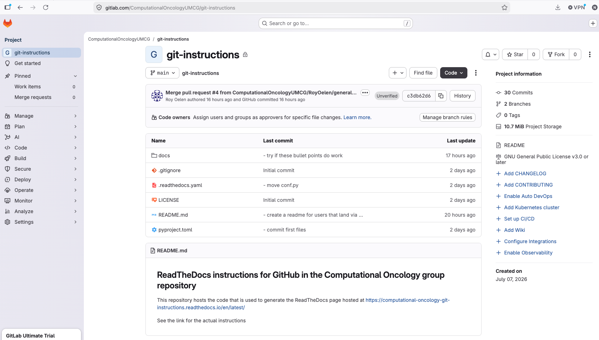

Linking Github to Gitlab for admins
===================================

If you want to use the issue tracker and planning of GitLab, with a repository on GitHub, you can link your GitHub repository to GitLab.

.. _create_gitlab_repository:
Step 1: Create GitLab repository
--------------------------------

Visit the `GitLab <https://gitlab.com/>`_ webpage 
Go to the 'Groups' and select 'ComputationOncologyUMCG'

.. image:: images/gitlab_linking_for_admins/go_to_groups.png
   :alt: go_to_groups
   :width: 80%

Then create a new project using 'Create project'

.. image:: images/gitlab_linking_for_admins/create_project.png
   :alt: create_project
   :width: 80%

Create a blank project

.. image:: images/gitlab_linking_for_admins/create_blank.png
   :alt: create_blank
   :width: 80%

Use the same 'project name' and 'project slug' that you also used on github, to make things clear.
Make sure you uncheck all of the 'Project Configuration' boxes.
Then click 'Create project'

.. image:: images/gitlab_linking_for_admins/create_project_button.png
   :alt: create_project_button
   :width: 80%

Next go to 'Settings', 'Access tokens'

.. image:: images/gitlab_linking_for_admins/select_access_tokens.png
   :alt: select_access_tokens
   :width: 50%

Then 'Add new token'

.. image:: images/gitlab_linking_for_admins/add_new_token.png
   :alt: select_access_tokens
   :width: 80%

Here we'll create a token. Naming should follow the GL\_\[applicationname]_FORWARD_TOKEN_T[nthtoken]. So for this example, it would be 'GH_GITINSTRUCTIONS_FORWARD_TOKEN_T1'

Set a description that states this token is used for forwarding.

Use the maximum expiration data, as that is a year.

Set the 'Maintainer' role

check the boxes for: 

- read_repository
- write_repository

Then 'Create project access token'

.. image:: images/gitlab_linking_for_admins/configure_token.png
   :alt: configure_token
   :width: 80%

The token will be created. Keep this tab open, as you won't be able to get the token again.

Finally, double-check your username, as we'll also need that for authentication. It will be what is after the '@'

.. image:: images/gitlab_linking_for_admins/get_username.png
   :alt: get_username
   :width: 80%

.. _add_gitlab_secrets:
Step 2: Add GitLab secrets
--------------------------

Now go back to GitHub, and go to the github repository you are trying to manage on GitLab. There, go to 'Settings':

.. image:: images/gitlab_linking_for_admins/go_to_gh_settings.png
   :alt: get_username
   :width: 80%

Then we'll goto 'Secrets and variables', then 'Actions'

.. image:: images/github_dockerhub_automation/to_secrets.png
   :alt: to_secrets
   :width: 80%

We will add the username and token as secrets. This way they can be used for authentication, without other people being able to see their actual contents. 
Click 'New repository secret'

.. image:: images/github_dockerhub_automation/click_new_secret.png
   :alt: click_new_secret
   :width: 80%

First, we'll add the GitLab user as a secret. We should name this as this GH\_\[applicationname]_FORWARD_USER. So here it would be GH_GITINSTRUCTIONS_FORWARD_USER

.. image:: images/gitlab_linking_for_admins/add_gl_user.png
   :alt: add_gl_user
   :width: 80%

You'll then see the secret being added.

.. image:: images/gitlab_linking_for_admins/see_secret_result.png
   :alt: see_secret_result
   :width: 80%

Next, we'll need to add a secret for the token we generated before. Use the same name you used when creating the gitlab token, and copy the token from GitLab.

.. image:: images/gitlab_linking_for_admins/add_gl_token.png
   :alt: add_gl_token
   :width: 80%

When pushing to GitLab, the GitHub environment does not have your credentials on hand. We thus have to add GitHub token to be able to clone from github before we do the push.

For generating a PAT, first go to your profile by clicking on it in the top-right, then click on Settings

.. image:: images/github_via_sourcetree/go_to_profile_settings.png
   :alt: go_to_profile_settings
   :width: 80%

Then, scroll all the way down on the left, to 'developer settings'

.. image:: images/github_via_sourcetree/to_developer_settings.png
   :alt: to_developer_settings
   :width: 80%

Next, go to 'personal access tokens' and 'Tokens (classic)'

.. image:: images/github_via_sourcetree/to_personal_access_tokens.png
   :alt: to_personal_access_tokens
   :width: 80%

Generate a new classic token

.. image:: images/github_via_sourcetree/generate_classic_token.png
   :alt: to_personal_access_tokens
   :width: 80%

Enter the information for the token. Again, let's use a structured name such as GH\_\[applicationname]_FORWARD_PAT_T[nttoken]. In this example that would be GH_GITINSTRUCTIONS_FORWARD_PAT_T1. This allows you to keep better track of them.
The expiration also depends on you, but three months is recommended, as this is a good balance of security while not having to create a new one too often.
The minimal permissions you need to give, is the 'repo' one. Finally click 'Generate token' at the bottom.

.. image:: images/github_via_sourcetree/setup_classic_token.png
   :alt: setup_classic_token
   :width: 80%

You will then be shown the new token (don't worry, this example has already been deleted). Github however, will only show the token now, so do not close this tab until you have copied over the PAT.

.. image:: images/github_via_sourcetree/token_success.png
   :alt: token_success
   :width: 80%

Either temporarily copy the token somewhere, or open a new tab so you don't lose the token. 

We will now add this token as a secret using the same way we added the secrets.

Now go back to GitHub, and go to the github repository you are trying to manage on GitLab. There, go to 'Settings':

.. image:: images/gitlab_linking_for_admins/go_to_gh_settings.png
   :alt: get_username
   :width: 80%

Then we'll goto 'Secrets and variables', then 'Actions'

.. image:: images/github_dockerhub_automation/to_secrets.png
   :alt: to_secrets
   :width: 80%

Click 'New repository secret'

.. image:: images/github_dockerhub_automation/click_new_secret.png
   :alt: click_new_secret
   :width: 80%

Now, we'll add the GitHub token as a secret. we wll name this the same as we named the token.

Now you'll see the three secrets we need

.. _add_gitlab_secrets:
Step 3: Create push action
--------------------------

Finally, we need to create an action for GitHub so that it knows that we want to perform a build and push. To do this, we need to create a YAML file in a specific directory of our repository.

Specifically we need a YAML in the .github/workflows/ folder. The YAML file created should then also have a descriptive name. For this project the file for example is .github/workflows/mirror-to-gitlab.yml

.. code-block:: yaml

    name: Mirror to GitLab

    on:
        push:

    jobs:
        mirror:
            runs-on: ubuntu-latest

            steps:
            - name: Authenticate GitHub
                run: |
                git config --global url."https://${{ secrets.GH_GITINSTRUCTIONS_FORWARD_PAT_T1 }}:@github.com/".insteadOf "https://github.com/"

            - name: Mirror repository
                run: |
                git clone --mirror https://github.com/${{ github.repository }}.git repo.git
                cd repo.git

                git push --mirror https://${{ secrets.GH_GITINSTRUCTIONS_FORWARD_USER }}:${{ secrets.GH_ICADEPMAP_FORWARD_TOKEN_T1 }}@gitlab.com/ComputationalOncologyUMCG/git-instructions.git

There are a couple of import things.

- you need to put in the secret name of the PAT
- you need to put in the secret name of the GitLab user that will forward
- you need to put in the secret name of the GitLab token
- you need to point to the right repository in the last line!

This action will mirror whenever there is a push on any branch.

After you have pushed a change, you can go to the action tab of the repository, and see the action that was run:

If there was a error, you can click on it to see why (maybe you specified one of the secrets incorrectly for example)

When you now go back to GitLab, you should see that it is a mirror of the GitHub code now

