Managing Github teams and repositories for admins
==========================================================================

As the organisation/group grows and both repositories and inviduals are added, the repositories will need to be organised to make sure that the right people have access to the right repositories. This is done by creating teams, and adding the right people to the right teams. The teams are then given access to the repositories.

.. _add_to_organisation:
Step 1: Add the user to the organisation
------------------

If the user is not yet part of the organization, they need to be added. If the user does not have a github account yet, request that they make one

Go to the organization dashboard:

.. image:: images/teams_and_repos_for_admins/to_organization_dashboard.png
   :alt: to_organization_dashboard
   :width: 80%

View the organzation:

.. image:: images/teams_and_repos_for_admins/view_organization.png
   :alt: view_organization
   :width: 80%

Go to the people tab:

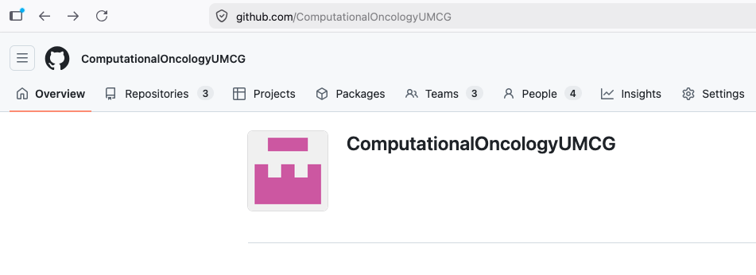

Click on the "Invite member" button:

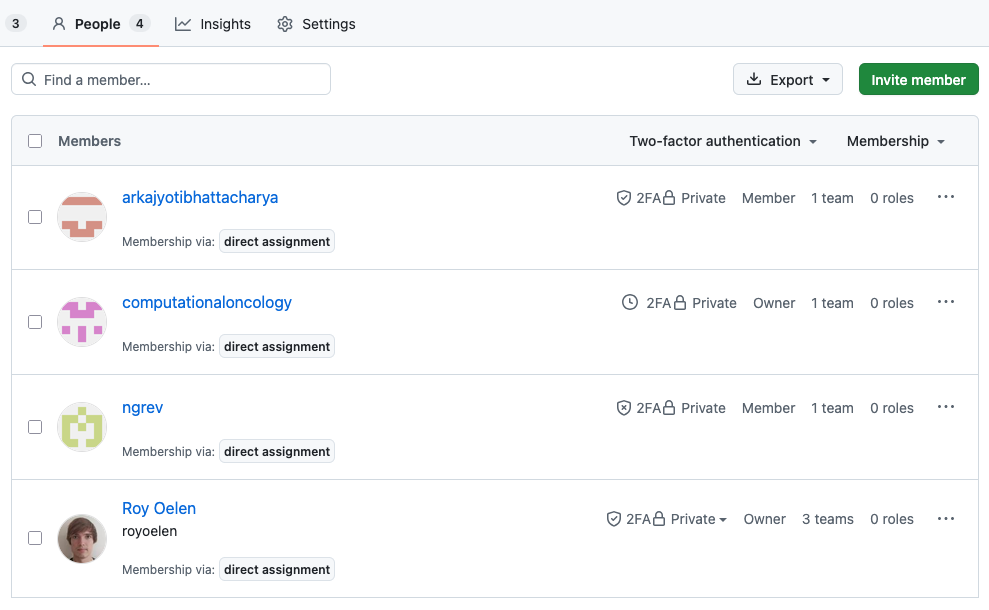

Enter the username of the user to be added, and click "Add" to add them to the organization. The user will receive an email invitation to join the organization. Once they accept the invitation, they will be part of the organization.:

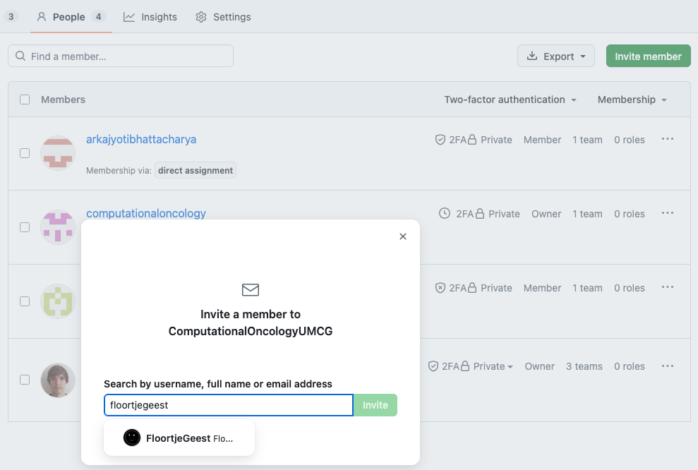

If the team already exists, you can immediatly add the user to a team:

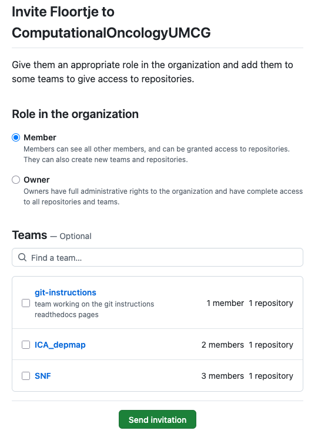

.. _create_repository:
Step 2: Create a new repository
------------------

If the user is going to work on a new project, we need to create a repository for that project. This is done by creating a new repository in the organization. 
If the project already exists, then the repository likely also already exists, and you can skip this step.

Go to the repositories tab:

Then click the "new repository" button:

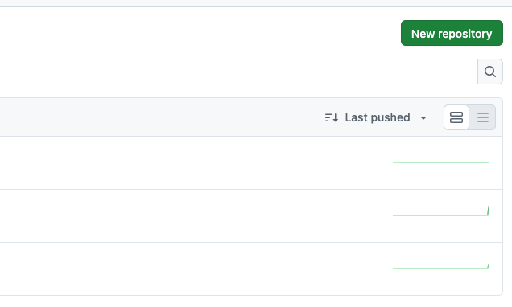

Fill in the required information here:

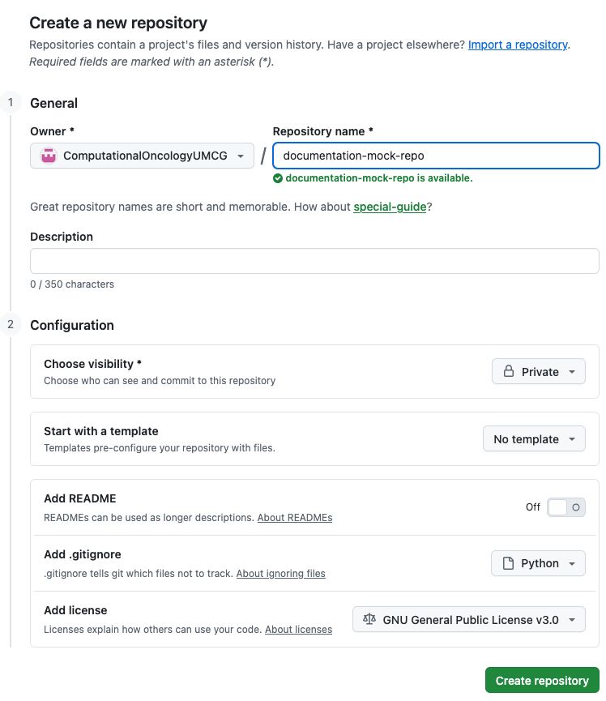

The repository name should be descriptive, and in most cases will be the same as the team name that will work on it. Visibility can be private or public, but for new projects, private is usually preferred. For publishing, visibility will at a later point be changed to public.
It is usually preferred to initialize with a readme, and a gitignore file for the language the repos is (mostly) in. The license in most cases should be GPL-3.0, but might depend on the project.

.. _create_team:
Step 2: Create a new team
------------------

If the user is going to work on a new project, we also need to create a team for that project. This is done by creating a new team in the organization.
If the project already exists, then the team likely also already exists, and you can skip this step.

Go back to the organization dashboard by clicking the organization name in the top left corner:

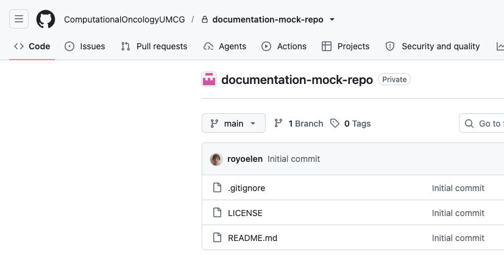

Now, click on the "Teams" tab:

.. image:: images/teams_and_repos_for_admins/click_teams.png
   :alt: click_teams
   :width: 80%

(optional) If a subteam needs to be create, then first click on the parent team:

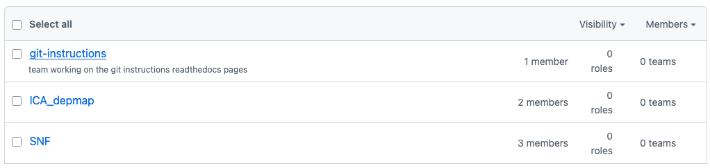

Now, create a new team by clicking the "New team" button:

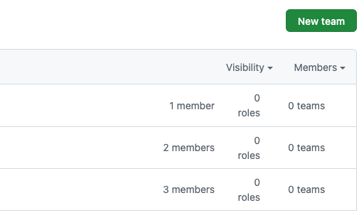

Then, name the team. In most cases, this should be named the same as the repository that the team will work on:

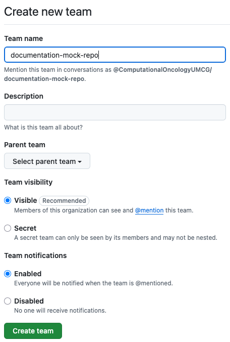

By default, the team page will open. You can however also just go there from the organization dashboard by clicking on the team name. Here, you can add members to the team, and give the team access to repositories. 

.. _add_repository_to_team:
Step 3: Add repository to Team
------------------

Now we need to link the repository to the team, so the team can write to the repository.

Go back to the organization dashboard by clicking the organization name in the top left corner:

Now, click on the "Teams" tab:

.. image:: images/teams_and_repos_for_admins/click_teams.png
   :alt: click_teams
   :width: 80%

Select the correct team:

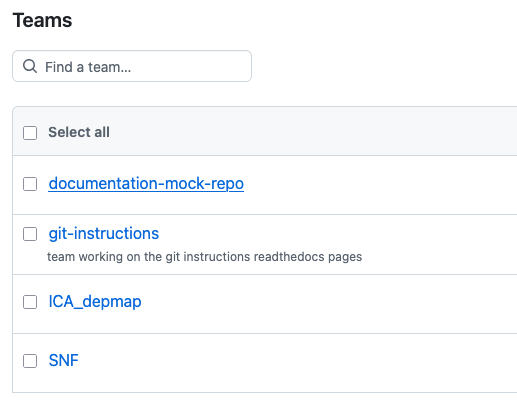

Go to the repositories tab:

.. image:: images/teams_and_repos_for_admins/click_repositories.png
   :alt: click_repositories
   :width: 80%

And click on "Add repository" to add a repository to the team:

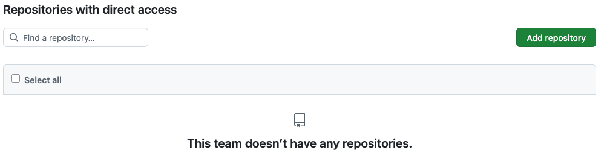

Select the correct repository, it should be named the same as the team:

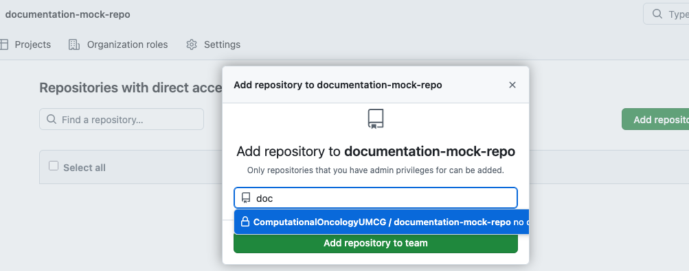

You should automatically return to the repositories tab. You can however also get there from the teams page, and them the repositories tab.

Next, we need to update the permissions for the team to the repository. By default, the team will have read access to the repository, but we want them to have write access. Click on "Manage access" to change this:

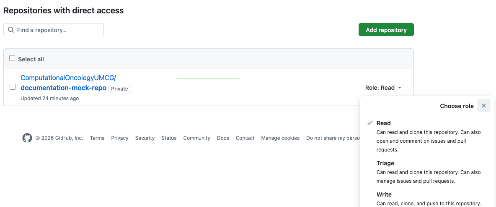

Setting this to write allows the team to work in the repository.

.. _add_user_to_team:
Step 4: Add user to Team
------------------

With teams and repositories in place, we need to add users to teams.

Go back to the organization dashboard by clicking the organization name in the top left corner:

Now, click on the "Teams" tab:

.. image:: images/teams_and_repos_for_admins/click_teams.png
   :alt: click_teams
   :width: 80%

Select the correct team:

Next, add the user to the team by clicking on "Add a member":

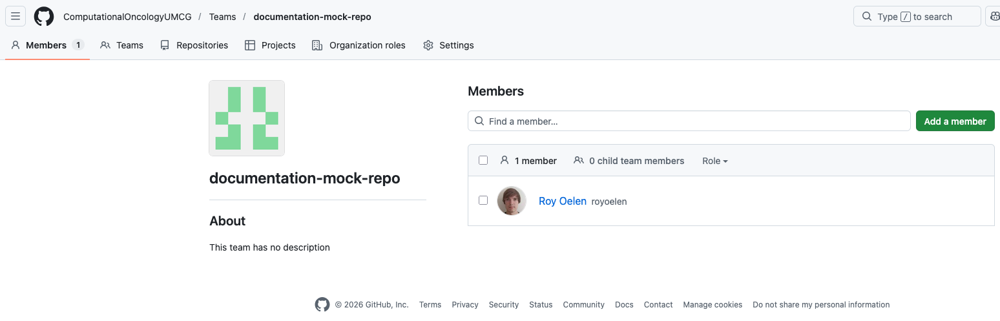

Enter the correct username and click "Invite":

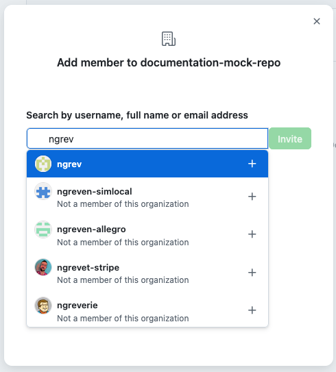

